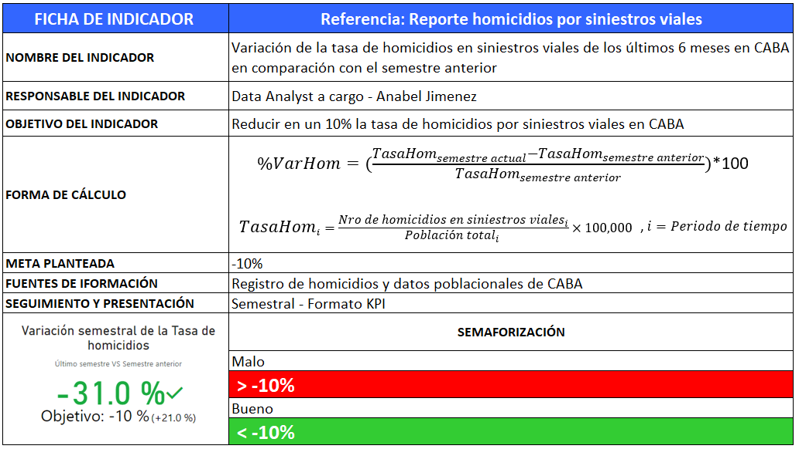
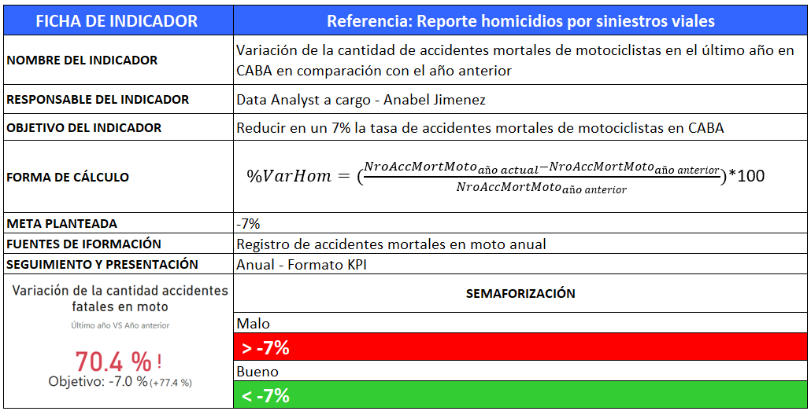
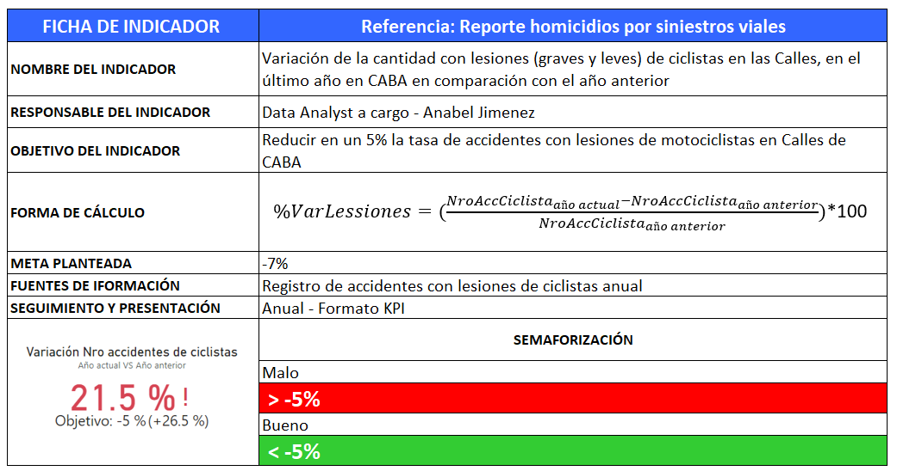
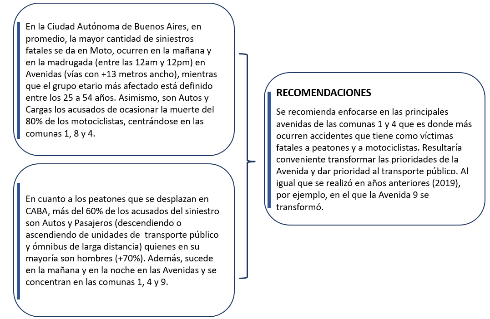

# 
Proyecto Individual N°2

### Introducción 

Este proyecto forma parte de la etapa de Labs para la carrera de Data Science de [Henry](https://www.soyhenry.com/). El proyecto utiliza data real sobre siniestros viales del Observatorio de Movilidad y Seguridad Vial (OSMV) de la Ciudad Autónoma de Buenos Aires y se desarrolla bajo un rol de **Data Analyst**.

### Objetivo
El objetivo principal 🎯 es elaborar un análisis exhaustivo con la data de [siniestros fatales](https://data.buenosaires.gob.ar/dataset/victimas-siniestros-viales) (2016-2021) ocurridos en CABA y obtener información relevante que permita a las autoridades locales tomar medidas que contribuyan a disminuir la cantidad de víctimas fatales. 

### Objetivos Específicos
* Realizar el tratamiento de limpieza del dataset.
* Presentación del Análisis exploratorio de los datos (Exploratory Data Analysis - EDA).
* Creación de Dashboard con insights recopilados del dataset.
* Definición de 2 KPIs relevantes al objetivo general.
* Recomendaciones que aborden el problema.
* Consolidar el desarrollo en un repositorio Github,¿.

--- 
### Recursos:
* Datasets: `homicidios`, `lesiones`

* Herramientas/software : Python, Power BI

* Otros: Data censo (años 2016-2021), Coordenadas ([Google Maps](https://support.google.com/maps/answer/18539?hl=es-MX&co=GENIE.Platform%3DDesktop#:~:text=C%C3%B3mo%20obtener%20las%20coordenadas%20de,decimal%20en%20la%20parte%20superior) y de [Comunas Buenos Aires](https://www.argentina.gob.ar/caba/comunas)), [Glosario de términos](https://buenosaires.gob.ar/sites/default/files/2023-04/Glosario_2019_OSV.pdf) y la página de *buenosaires.gob.ar*.

Este proyecto tiene 4 secciones: `ETL`, `Análisis exploratorio de los datos`, `Elaboración dashboard`, `Recomendaciones`.

🔍 Se recomienda leer los notebooks a los que se hace referencia a lo largo de este archivo, contienen información detallada de cada análisis.

--- 

### 1. ETL
Como primer paso se realiza el ETL de cada uno de los archivos proporcionados. El objetivo es preparar y disponibilizar los datos para su posterior análisis. Incluye el tratamiento y carga.

Nombre de los Notebooks del ETL:
* ETL.ipynb

---
### 2. Análisis exploratorio de Datos 
`EDA`: Algunos de los aspectos clave que se exploró incluyen: *búsqueda de valores faltantes, valores atípicos/extremos u outliers y registros duplicados, visualizaciones para cada variable (cualitativa y cuantitativa), entre otros*. Estos pasos permitieron obtener una visión detallada y completa de los datos, proporcionando así una base sólida para entender a profundidad los datos. Cada paso y decisión está documentado en el notebook, aspi como conclusiones por cada etapa desarrollada.

Nombre de los Notebooks del EDA:
* EDA.ipynb

---
### 3. Dashboard

`KPIs` : Se desarrolló 2 KPIs de acuerdo a la consigna y uno adicional, los cuales se integraron en el dashboard en Power BI. Estos KPIs están diseñados para evaluar el estado en siniestros viales en relación con el objetivo general, proporcionando así información estratégica para las autoridades locales de la Ciudad Autónoma de Buenos Aires.

A continuación la ficha de los indicadores.

**KPI 1**

**KPI 2**

**KPI 3**

`Contenido Dashboard`: El dashboard contiene los filtros necesarios por hoja de acuerdo al tipo de información que presentan, en otras palabras es interactivo. Contiene además los KPIs mencionados anteriormente y una carátula con menú de navegación que redirige a cada hoja. 

### 4. Recomendaciones - Resultados

Las recomendaciones se realizaron en base a los insights del análisis. 

En cuanto al tema de HOMICIDIOS se proponen recomendaciones en base a la **data de lesiones** y de un estudio publicado por OSMV sobre los [Factores de Riesgo Vial en Motovehículos](https://buenosaires.gob.ar/sites/default/files/2023-08/Sexto%20estudio%20observacional%20_casco_OMSV.pdf), ya que los motociclistas resultó ser un tema preocupante por la cantidad de víctimas fatales que representa a lo largo de los años. Asimismo, me guié de algunas noticias de CABA sobre soluciones efectivas hechas en años anteriores que impactaron positivamente con reducir la cantidad de siniestros fatales, algunos se pueden encontrar aqui: [Plan de seguridad Vial del 2020-2023](https://buenosaires.gob.ar/movilidad/plan-de-seguridad-vial/plan-de-seguridad-vial-de-la-ciudad-2020-2023) o en soluciones de otros países de la zona como Perú: [Carril solo para motocicletas para evitar el entrecruzamiento con los vehículos](https://gestion.pe/peru/rutas-de-lima-panamericana-norte-y-sur-donde-se-registran-el-mayor-numero-de-incidentes-noticia/) o [Restringir circulación de motocicletas en vías rápidas](https://larepublica.pe/sociedad/2023/08/22/costa-verde-por-que-las-motocicletas-estan-prohibidas-en-el-circuito-de-playas-269236).

En cuanto al tema de LESIONES se proponen recomendaciones en base a la **data de lesiones** y el [Plan de Seguridad Vial de la ciudad del 2016-2021](https://buenosaires.gob.ar/movilidad/plan-de-seguridad-vial/plan-de-seguridad-vial-de-la-ciudad) del cual se utilizó data complementaria como las causas de los siniestros (exceso de velocidad, uso de medidas de seguridad). 

Adicionalmente, se revisó el [Plan de seguridad Vial del 2020-2023](https://buenosaires.gob.ar/movilidad/plan-de-seguridad-vial/plan-de-seguridad-vial-de-la-ciudad-2020-2023) de la Ciudad y se complementó con algunos informes de temas específicos, los que se pueden revisar [Aquí](https://buenosaires.gob.ar/jefaturadegabinete/movilidad/investigaciones-de-seguridad-vial).

A continuación, la descripción de los insights y recomendaciones finales:

#### HOMICIDIOS

#### LESIONES

#### POWER BI
* Archivo Power BI (publicado): [Link](https://goo.su/s56pi)

#### REPOSITORIO
* [Link](https://github.com/SAnabel-Jimenez/PI-02-DataAnalytics-SAJ.git)

---
### Contacto
Autor: Anabel Jimenez

Enlaces para ponerse en contacto:
  - Correo Electrónico: [anabeljimenezh19@gmail.com](mailto:tu@email.com)
  - LinkedIn: [@AnabelJimenez](https://twitter.com/NuestraCuenta)
--- 
 

